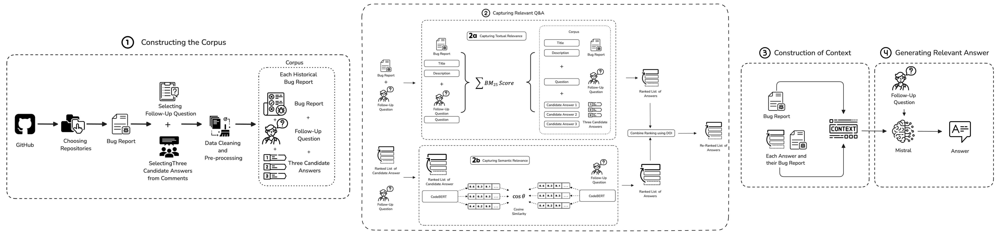

# BugMentor: Generating Answers to Follow-up Questions from Software Bug Reports


Welcome to the replication package for **BugMentor**, a novel approach that combines structured information retrieval and neural text generation to generate appropriate answers to follow-up questions from software bug reports.

## Table of Contents

1. [Introduction](#introduction)
2. [How BugMentor Works](#how-bugmentor-works)
3. [Repository Structure](#repository-structure)
4. [Requirements](#requirements)
   - [Operating System](#operating-system)
   - [Hardware Requirements](#hardware-requirements)
   - [Software Requirements](#software-requirements)
5. [Installation](#installation)
6. [Usage](#usage)
   - [Quick Start](#quick-start)
   - [Running Complete Experiments](#running-complete-experiments)
7. [Dataset](#dataset)
8. [Results](#results)
9. [Prompt Template](#prompt-template)
10. [How to Cite](#how-to-cite)
11. [Authors](#authors)
12. [License](#license)

## Introduction

Software bug reports often lack crucial information (e.g., steps to reproduce), which makes bug resolution challenging. Developers thus ask follow-up questions to capture additional information. However, according to existing evidence, bug reporters often face difficulties answering them, which leads to the premature closing of bug reports without any resolution.

**BugMentor** addresses this challenge by leveraging:

- **Structured Information Retrieval**: Identifies past relevant bug reports to a given bug report
- **Neural Text Generation**: Uses advanced LLMs (Mistral, ChatGPT, LLaMA) to generate contextual answers
- **Multi-metric Evaluation**: Evaluated using BLEU Score, Semantic Similarity, and human studies

## How BugMentor Works



BugMentor follows a three-stage pipeline to generate answers to follow-up questions from bug reports


## Repository Structure

```
BugMentor - Replication Package
├── data.zip                    # Compressed dataset files
├── developer-study.zip         # Developer study results and materials
├── manual_analysis.zip         # Manual analysis data and scripts
├── results.zip                 # All experimental results
├── requirements.txt            # Python dependencies
├── src/                        # Source code directory
│   ├── ablation/              # Ablation study scripts
│   │   ├── embedding_mistral.py
│   │   ├── embedding.py
│   │   └── ro_mistral.py
│   ├── baselines/             # Baseline implementations
│   │   ├── answerbot/         # AnswerBot baseline
│   │   ├── bm25/              # BM25 baseline
│   │   ├── chatgpt/           # ChatGPT baseline
│   │   ├── disentanglement/   # Disentanglement baseline
│   │   ├── llama/             # LLaMA baseline
│   │   └── mistral/           # Mistral baseline
│   ├── bugmentor/             # BugMentor implementation
│   │   ├── augumentation/      # Embedding-based reranking
│   │   ├── generation/        # Answer generation scripts
│   │   └── retrieval/         # Information retrieval pipeline
│   ├── data_preprocessing/    # Data preprocessing utilities
│   ├── evaluation/           # Evaluation scripts and metrics
│   ├── manual_analysis/      # Manual analysis notebooks
│   └── post_processing/      # Post-processing utilities
└── README.md                 # This file
```

## Requirements
### Dependencies
We recommend using a virtual environment to install the packages. To install the dependencies use the snippet below.
```
pip install -r requirements.txt
```
### Operating System

Tested on:
- **Ubuntu 20.04 LTS** or later
- **macOS Monterey** or later
- **Windows 10/11** (via WSL2 recommended)

### Hardware Requirements

**Minimum:**
- CPU: 4 cores
- RAM: 8 GB
- Storage: 10 GB free space

**Recommended:**
- CPU: 8+ cores
- RAM: 16+ GB
- GPU: NVIDIA with CUDA support (for faster processing)
- Storage: 20+ GB free space

### Software Requirements

- **Python**: 3.11.x
- **ElasticSearch**: For information retrieval (optional for basic functionality)
- **Docker**: For ElasticSearch setup (recommended)

## Installation

1. **Clone the repository:**
   ```bash
   git clone <repository-url>
   cd "BugMentor - Replication Package"
   ```

2. **Create a virtual environment:**
   ```bash
   python -m venv bugmentor_env
   source bugmentor_env/bin/activate  # macOS/Linux
   # bugmentor_env\Scripts\activate    # Windows
   ```

3. **Install dependencies:**
   ```bash
   pip install -r requirements.txt
   ```

4. **Extract datasets:**
   ```bash
   unzip data.zip
   unzip results.zip
   unzip developer-study.zip
   unzip manual_analysis.zip
   ```

### ElasticSearch Setup (Optional)

- Install ElasticSearch using the guidelines [here](https://www.elastic.co/guide/en/elasticsearch/reference/current/docker.html)
- To run the algorithm_using_elastic_search.py file, run elasticsearch on docker, and update the certificate details on the file as per your certificate

## Usage

### Quick Start

1. **Run data preprocessing:**
   ```bash
   cd src/data_preprocessing
   python 1__preprocess.py
   python 2__corpus_preprocessing.py
   ```

2. **Test BugMentor retrieval:**
   ```bash
   cd ../bugmentor/retrieval
   python 1__bm25.py
   ```

3. **Generate answers:**
   ```bash
   cd ../generation
   python mistral_generation.py  # or chatgpt_generation.py, llama_generation.py
   ```

4. **Evaluate results:**
   ```bash
   cd ../../evaluation
   python evaluate.py
   ```

### Running Complete Experiments

1. **Run all baselines:**
   ```bash
   cd src/baselines/bm25
   python bm25_baseline.py
   
   cd ../mistral
   python mistral_baseline.py
   
   # Continue with other baselines...
   ```

2. **Execute BugMentor pipeline:**
   ```bash
   cd ../../bugmentor
   # Follow the numbered scripts in each subdirectory
   ```

3. **Generate performance summary:**
   ```bash
   cd ../evaluation
   python performance_summary.py
   ```

## Dataset

The dataset is organized into two main components:

- **bugmentor_corpus**: Collection of past bug reports with their three candidate answers
- **bugmentor_gold**: Collection of bug reports and follow-up questions with manually annotated candidate answers

Dataset files are provided in compressed format. Extract using the installation instructions above.

## Results

All experimental results are available in the `results.zip` file, containing:

- **Baseline Results**: Performance of all four baseline methods
- **BugMentor Results**: Complete results from our approach
- **Ablation Study**: Results from ablation experiments
- **Developer Study**: Human evaluation results from 23 participants

Extract the results and refer to individual result files for detailed analysis.

## Prompt Template

BugMentor uses the following prompt template for answer generation:

```
Answer Questions on the bug report based on the relevant information.
Here is a bug report which has incomplete information.
### Bug Report - 
{bug_report}

There is a follow-up question asking for missing information.
Here is some relevant information from a previous bug report.
{relevant_candidate_answer}

Can you answer the question below based on the bug report?
Here is the question.

## Question- 
{question}

## Answer : 
```
## Preprint
The preprint of this work is available at: http://arxiv.org/abs/2304.12494 

Zenodo Link :  http://bit.ly/3I8l86a

For any further questions or issues, please feel free to open an issue on the GitHub page.


## Authors

- **[Usmi Mukherjee]** - [Dalhousie University], [usmi.mukherjee@dal.ca](mailto:usmi.mukherjee@dal.ca)
- **[Mohammad Masudur Rahman]** - [Dalhousie University], [masud.rahman@dal.ca](mailto:masud.rahman@dal.ca)

## License

This project is licensed under the MIT License. See `LICENSE` file for details.

---

**Note**: This is a replication package for research purposes. For questions or issues, please open an issue in the repository or contact the authors directly.